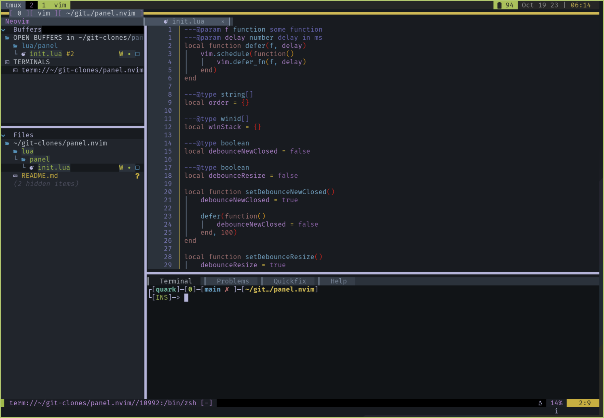

# panel.nvim

**Note**: I would consider this unstable/alpha at the moment. Expect breaking changes and whatnot! I will do my best to avoid such

A ~~VSCode~~-ish bottom panel for Neovim



## Installation

Lazy:

```lua
{
	"distek/panel.nvim",
	config = function()
        require("panel").setup({
            -- config goes here, see the "Configuration" section
        })
    end,
}
```

## Why?

I like VS Code's panel concept, but I _don't_ like VS Code's pain-in-the-ass customization.

## Configuration

Configuration of panel is a bit weird!

The way panel works is:

- use the view's `open()` function (set by the user) to return the view's buffer ID
- set the panel window to that buffer
- update the winbar of the panel, 'cause we fancy

Here's an example that just has a terminal:

```lua
{
	"distek/panel.nvim",
	config = function()
        require("panel").setup({
            size = 15,
            views = {
                {
                    -- the name of the panel view (will also be shown in the winbar)
                    name = "Terminal",

                    -- the filetype to lock to the panel
                    ft = "toggleterm",

                    -- The open function should return the buffer ID of whatever we want in the panel
                    open = function()
                        -- open a new terminal in a split (we *want* to create a new window)
                        vim.cmd("split +term")

                        -- Grab the buffer's ID
                        local bufid = vim.api.nvim_get_current_buf()

                        -- hide the window (closing could delete the buffer, we don't want that)
                        vim.api.nvim_win_hide(vim.api.nvim_get_current_win())

                        -- Plugins would do this for you typically
                        vim.bo[bufid].filetype = "toggleterm"

                        -- finally return the new buffer ID
                        return bufid
                    end,

                    -- close is for a specific scenario in which the filetype relies on a specific window
                    -- Trouble is a good example of this
                    close = nil,

                    -- Additional window options to apply to the panel when this buffer is focused
                    wo = {
                        winhighlight = "Normal:ToggleTermNormal",
                        number = false,
                        relativenumber = false,
                        wrap = false,
                        list = false,
                        signcolumn = "no",
                        statuscolumn = "",
                    },
                },
                -- ... more panels go here
            }
        })
    end
}
```

Three main things we need to focus on here in the `open` function:

1. Create a new window (if the command doesn't already do this)
   - if the command has a `toggle` and an `open` command, using the `open` is usually the way to go
2. Store the buffer ID of the created window
3. Hide `vim.api.nvim_win_hide(winid)` whatever the original window was (if not set in the command's args, see the Trouble example for a special case)
4. Return the buffer ID

Here's some more examples:

<details>
    <summary>trouble.nvim</summary>

https://github.com/folke/trouble.nvim

Note: as mentioned above, Trouble is a special case. In which we specify the panel window ID as the winid when opening

(This example might change in the future - watch this space!)

```lua
    {
        name = "Problems",
        ft = "Trouble",
        open = function()
            require("trouble").open({
                win = require("panel").win,
            })

            local bufid = vim.api.nvim_get_current_buf()

            vim.bo[bufid].buflisted = false

            vim.api.nvim_create_autocmd({
                "BufEnter",
            }, {
                callback = function(ev)
                    if string.match(ev.match, "Trouble") then
                        require("trouble").set_win(require("panel").win)
                    end
                end,
            })

            return bufid
        end,
        close = false,
        wo = {
            winhighlight = "Normal:EdgyTermNormal",
        },
    },
```

</details>

<details>
    <summary>quickfix list</summary>

```lua
    {
        name = "Quickfix",
        ft = "qf",
        open = function()
            vim.cmd(":copen")
            local bufid = vim.api.nvim_get_current_buf()

            vim.api.nvim_win_hide(vim.api.nvim_get_current_win())

            return bufid
        end,
        close = false,
        wo = {
            winhighlight = "Normal:ToggleTermNormal",
        },
    },
```

</details>

<details>
    <summary>nvim help docs</summary>

```lua
    {
        name = "Help",
        ft = "help",
        open = function()
            local bufid = 0
            for _, v in ipairs(vim.api.nvim_list_bufs()) do
                if vim.bo[v].filetype == "help" then
                    bufid = v
                    for _, win in vim.api.nvim_list_wins() do
                        if vim.api.nvim_win_get_buf(win) == bufid then
                            vim.api.nvim_win_hide(win)
                            break
                        end
                    end
                    break
                end
            end

            if bufid == 0 then
                vim.cmd("help help")
                bufid = vim.api.nvim_get_current_buf()
                vim.api.nvim_win_hide(vim.api.nvim_get_current_win())
            end

            return bufid
        end,
        close = false,
        wo = {
            number = false,
            relativenumber = false,
            list = false,
            signcolumn = "no",
            statuscolumn = "",
            winhighlight = "Normal:EdgyTermNormal",
        },
    },
```

</details>

Please feel free to submit others (that you've tested thoroughly)!

## API?

You can change pretty much whatever you like at any time you like. Just... be careful?

### Overview

```lua
package {
    -- Variables --

    -- the config
    config: {
        -- height of the panel
        size: number
        -- the panel views
        views: {
            {
                -- the view name
                name: string
                -- the view filetype
                ft: string
                -- how to open the view; return the buffer's ID
                open: function() -> number
                -- how to close the view when navigating away (if applicable)
                close: function() | nil
                -- window options to apply to view
                wo: table<string, any>
            }
        }
    }

    -- table of panel name ("Terminal") keys to buffer associations
    bufs: table<string, number|nil>

    -- name of the current view
    currentView: string|nil

    -- winid of the panel (can change frequently)
    win: nil

    -- stores the default window opts applied to new windows before applying specific window opts
    -- setup in the local createWindow function
    defaultWinOpts: table

    -----------------------------------------------------------------------------------------------------------

    -- Event blockers --

    -- used to indicate to panel that _you_ resized, otherwise it will force the size back to config.panel.size
    winResized: boolean

    -- can be set to prevent panel from forcing a current panel view's FT from being absorbed.
    -- set it back to false once your specific file is open completely
    ignoreFTAutocmd: boolean

    -- prevent panel's WinClosed autocmds from running on true
    winClosing: boolean

    -----------------------------------------------------------------------------------------------------------

    -- Functions --

    -- wouldn't recommend modifying any of these, but you do you

    -- what happens when you click a winbar tab
    handleClickTab: function()

    -- trigger a resize of the panel (prevents WinResized event)
    resize: function()

    -- check if panel is open
    -- returns boolean
    isOpen: function() -> boolean

    -- toggle the panel open/closed, optionally focusing it if focus == true
    toggle: function(focus?: boolean)

    -- close the panel
    close: function()

    -- focus the next panel
    next: function()

    -- focus the previous panel
    previous: function()

    -- open the panel, optionally focusing it if focus == true
    open: function(focus?: boolean)

    -- set's the panel's view to name
    setView: function(name: string)

    -- setup function
    setup: function(config: config)
}
```

### Resizing

If you have a mapping for resizing, include a:

```lua
	require("panel").winResized = true
```

at the beginning of the map function, and a

```lua
	require("panel").winResized = false
```

at the end, to prevent panel from forcing it's size back to the configured size.

This will also save the new size so it can be recalled later when panel needs to resize itself

## Known issues

- Plugins that depend on the original window they were opened with can be problematic and will require special attention
  - i.e. [trouble.nvim](https://github.com/folke/trouble.nvim)

## Contributing

Should you feel inclined to do so:

- Use stylua to format code (or format manually)
  - Tabs, not spaces, for indents
  - Wrap code longer than 80 chars as best you can
    - Comments are excluded
    - Long strings can also be excluded
- Include lua_ls type annotations where applicable
  - Functions that have no parameters and return nil not included
